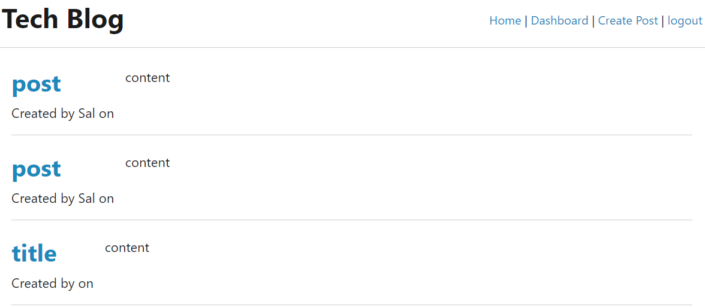

# ModelViewController

## Description
CMS-style blog site similar to a Wordpress site, where developers can publish their blog posts and comment on other developers’ posts as well. The app follows the MVC paradigm in its architectural structure, using Handlebars.js as the templating language, Sequelize as the ORM, and the express-session npm package for authentication

## Screenshot

## Links

Heroku Deployed Link: https://techblog-1042.herokuapp.com/

Github Repo: https://github.com/michaelyiu1/ModelViewController
